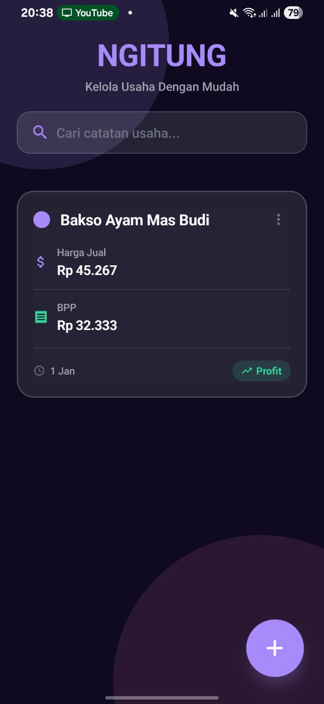
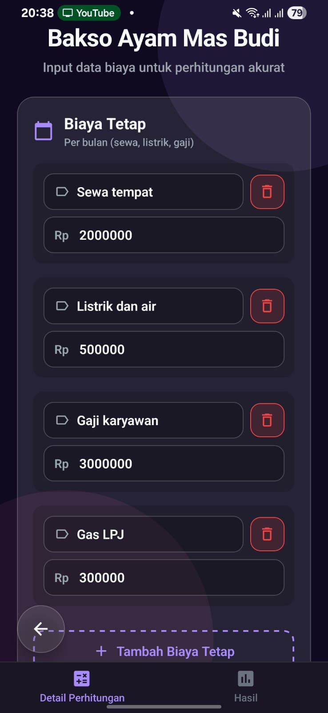
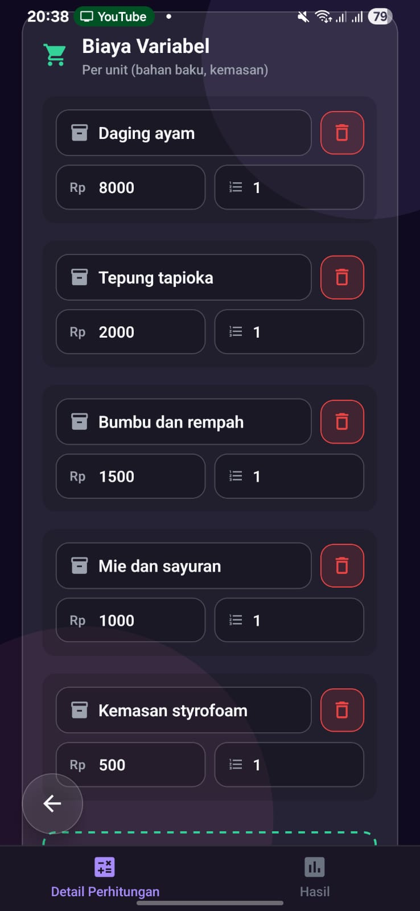
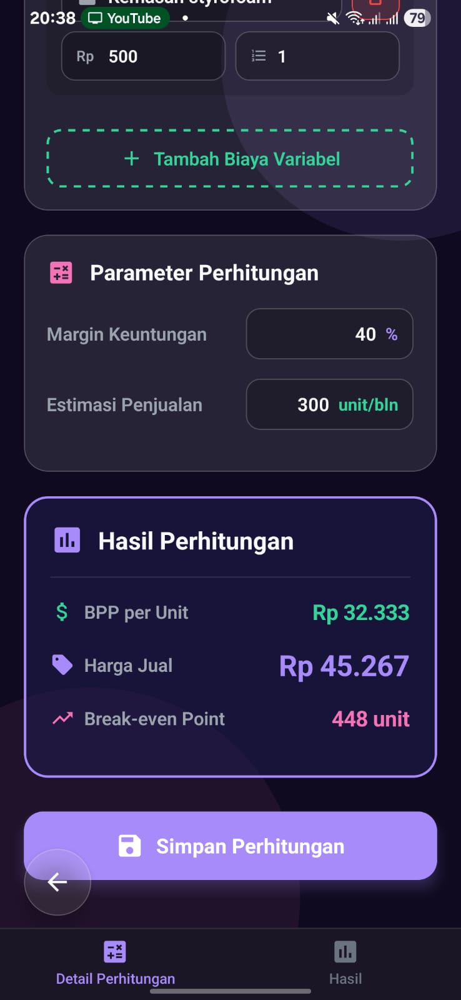
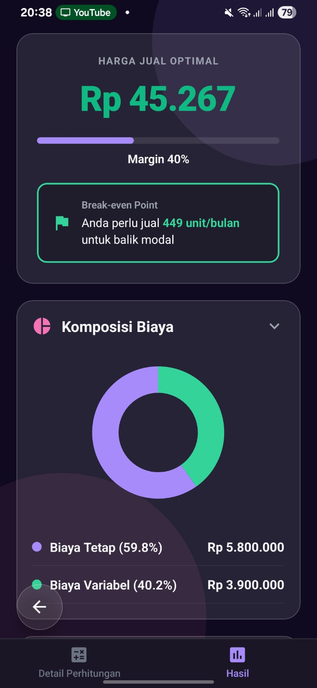
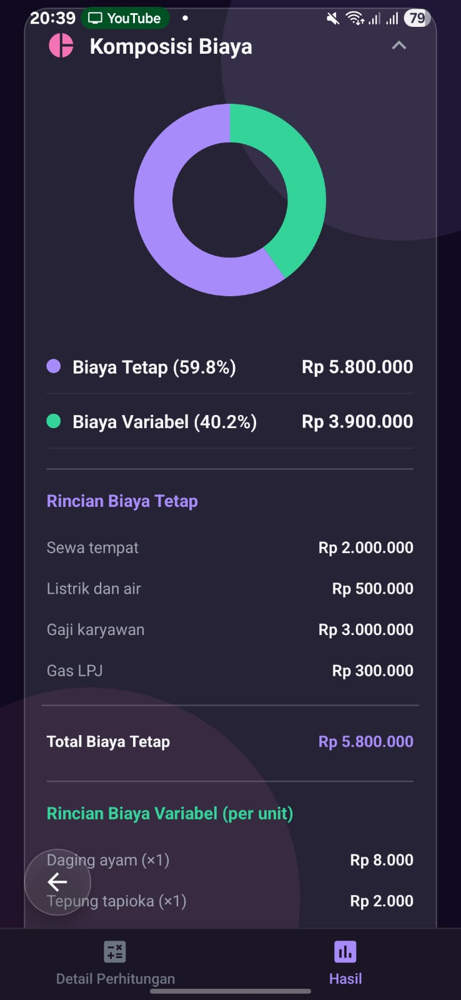
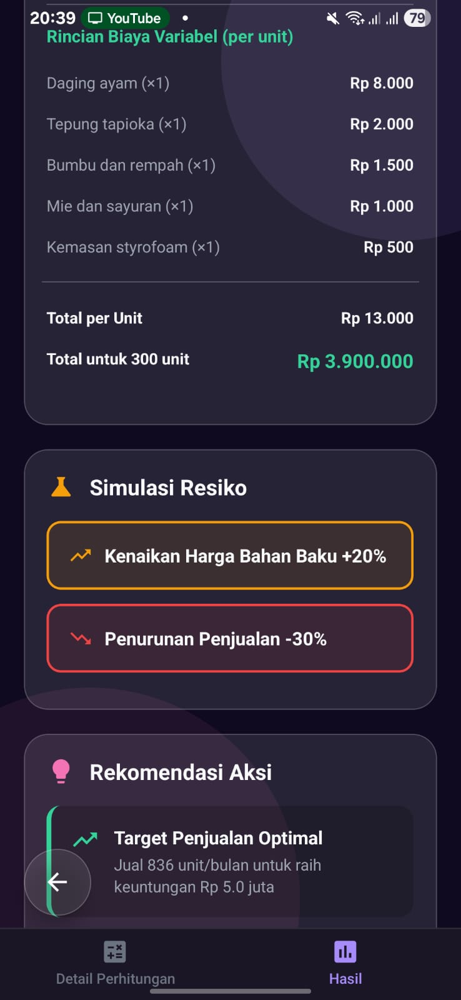
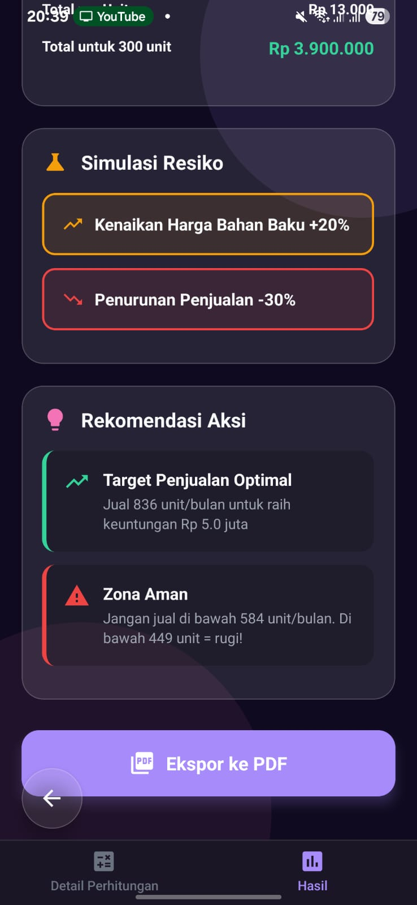

<div align="center">
  
# 📊 NGITUNG

**Kelola Usaha Dengan Mudah**

[](https://reactnative.dev/)
[](https://expo.dev/)
[](https://www.typescriptlang.org/)
[]()

A modern, beautiful mobile application for managing business costs and calculating product pricing. Built with React Native and Expo, NGITUNG helps small business owners and entrepreneurs easily calculate Cost of Goods Sold (COGS/BPP) and determine optimal selling prices.

</div>

---

## ✨ Features

- 📝 **Create Multiple Business Notes** - Organize different products or business ventures separately
- 💰 **Fixed Costs Management** - Track monthly overhead costs like rent, utilities, salaries
- 📦 **Variable Costs Calculation** - Manage per-unit costs with quantities (materials, packaging, etc.)
- 📊 **Automatic BPP Calculation** - Real-time Cost of Goods Sold calculation
- 💵 **Profit Margin Control** - Set custom profit margins to determine selling prices
- 🎨 **Customizable Note Colors** - Color-code your business notes for easy identification
- 🔍 **Search Functionality** - Quickly find specific business notes
- 💾 **Persistent Storage** - All data is saved locally on your device
- 🌙 **Beautiful Dark UI** - Modern glassmorphism design with smooth animations
- 📱 **Cross-Platform** - Works on iOS, Android, and Web

---

## 📱 Screenshots

<div align="center">

### Home Screen

<table>
  <tr>
    <td align="center" width="33%">
      
      <br />
      <sub><b>Main Dashboard</b></sub>
      <br />
      <sub>Welcome screen to show all your notes!</sub>
    </td>
  </tr>
</table>

### Cost Management & Calculations

<table>
  <tr>
    <td align="center" width="33%">
      
      <br />
      <sub><b>Fixed Cost</b></sub>
      <br />
      <sub>Something like tools and stuff</sub>
    </td>
    <td align="center" width="33%">
      
      <br />
      <sub><b>Variable Cost</b></sub>
      <br />
      <sub>Something like ingredients and such</sub>
    </td>
    <td align="center" width="33%">
      
      <br />
      <sub><b>Calculation Results</b></sub>
      <br />
      <sub>View BPP and selling price</sub>
    </td>
  </tr>
</table>

### Results & Settings

<table>
  <tr>
    <td align="center" width="50%">
      
      <br />
      <sub><b>Optimal Selling Price</b></sub>
      <br />
      <sub>Highlight of the Calculations</sub>
    </td>
    <td align="center" width="50%">
      
      <br />
      <sub><b>Cost Composition</b></sub>
      <br />
      <sub>Calculation Details</sub>
    </td>
  </tr>
  <tr>
    <td align="center" width="33%">
      
      <br />
      <sub><b>Risk Simulation</b></sub>
      <br />
      <sub>Predict your risks!</sub>
    </td>
    <td align="center" width="33%">
      
      <br />
      <sub><b>Export to PDF</b></sub>
      <br />
      <sub>Share your Calculations</sub>
    </td>
  </tr>
</table>

</div>

---

## 🚀 Getting Started

### Prerequisites

- [Node.js](https://nodejs.org/) (v18 or newer)
- [npm](https://www.npmjs.com/) or [yarn](https://yarnpkg.com/)
- [Expo CLI](https://docs.expo.dev/get-started/installation/) (optional, can use npx)

### Installation

1. **Clone the repository**

   ```bash
   git clone https://github.com/HHHAAAANNNNN/ngitung-app.git
   cd ngitung-app
   ```

2. **Install dependencies**

   ```bash
   npm install
   ```

3. **Start the development server**

   ```bash
   npx expo start
   ```

4. **Run the app**

   - **iOS Simulator**: Press `i` in the terminal
   - **Android Emulator**: Press `a` in the terminal
   - **Web Browser**: Press `w` in the terminal
   - **Physical Device**: Scan the QR code with the Expo Go app ([iOS](https://apps.apple.com/app/expo-go/id982107779) | [Android](https://play.google.com/store/apps/details?id=host.exp.exponent))

---

## 📖 How to Use

### 1. Create a Business Note

- Tap the **"+"** floating action button on the home screen
- Enter a name for your business calculation (e.g., "Bakso Ayam", "Kue Brownies")
- Tap **"Buat Catatan"** to create the note

### 2. Add Fixed Costs

Fixed costs are monthly expenses that don't change with production volume:

- Tap on your created note
- Navigate to the **"Biaya Tetap"** section
- Click **"+ Tambah Biaya Tetap"**
- Enter cost name (e.g., "Sewa Kios", "Gaji Karyawan")
- Enter monthly amount
- Add as many fixed costs as needed

### 3. Add Variable Costs

Variable costs are per-unit expenses:

- Scroll to the **"Biaya Variabel"** section
- Click **"+ Tambah Biaya Variabel"**
- Enter cost name (e.g., "Daging Ayam", "Tepung")
- Enter unit price
- Enter quantity per product
- Add all your variable costs

### 4. Set Sales Projection & Profit Margin

- Enter **"Estimasi Penjualan"** (estimated monthly sales units)
- Enter **"Margin Keuntungan"** (profit margin percentage, e.g., 30 for 30%)

### 5. Calculate & View Results

- Tap **"Hitung"** to calculate
- The app will automatically calculate:
  - **BPP (Biaya Pokok Produksi)** - Cost of Goods Sold per unit
  - **Harga Jual** - Recommended selling price
- Tap **"Lihat Hasil Lengkap"** to see detailed breakdown
- Export results as PDF or share them

### 6. Customize & Manage Notes

- Tap the **three-dot menu** on any note card
- Choose a custom color for the note badge
- Delete notes you no longer need

---

## 🛠️ Technology Stack

- **[React Native](https://reactnative.dev/)** `0.81.5` - Cross-platform mobile framework
- **[Expo](https://expo.dev/)** `~54.0.30` - Development platform and tools
- **[TypeScript](https://www.typescriptlang.org/)** `~5.9.2` - Type-safe JavaScript
- **[Expo Router](https://docs.expo.dev/router/introduction/)** `~6.0.21` - File-based routing
- **[React Native Reanimated](https://docs.swmansion.com/react-native-reanimated/)** - Smooth animations
- **[React Native Paper](https://callstack.github.io/react-native-paper/)** - UI components
- **[Expo Vector Icons](https://icons.expo.fyi/)** - Icon library
- **[AsyncStorage](https://react-native-async-storage.github.io/async-storage/)** - Local data persistence
- **[Expo Print](https://docs.expo.dev/versions/latest/sdk/print/)** - PDF export functionality

---

## 📁 Project Structure

```
ngitung-app/
├── app/                      # Main application code (Expo Router)
│   ├── (tabs)/              # Tab-based navigation
│   │   ├── detail/          # Cost calculation detail pages
│   │   ├── result.tsx       # Results display page
│   │   └── _layout.tsx      # Tab layout configuration
│   ├── index.tsx            # Home page with notes list
│   └── _layout.tsx          # Root layout
├── src/
│   ├── context/             # React Context providers
│   │   └── NoteContext.tsx  # Note state management
│   └── utils/               # Utility functions
├── assets/                  # Images, fonts, and static files
├── components/              # Reusable UI components
├── constants/               # App constants and configuration
├── screenshots/             # App screenshots for documentation
├── app.json                 # Expo configuration
├── package.json             # Dependencies and scripts
└── tsconfig.json            # TypeScript configuration
```

---

## 📜 Available Scripts

- `npm start` - Start the Expo development server
- `npm run android` - Open app in Android emulator
- `npm run ios` - Open app in iOS simulator
- `npm run web` - Open app in web browser
- `npm run lint` - Run ESLint to check code quality

---

## 🤝 Contributing

Contributions are welcome! If you'd like to improve NGITUNG:

1. Fork the repository
2. Create a feature branch (`git checkout -b feature/AmazingFeature`)
3. Commit your changes (`git commit -m 'Add some AmazingFeature'`)
4. Push to the branch (`git push origin feature/AmazingFeature`)
5. Open a Pull Request

---

## 📄 License

This project is private. All rights reserved.

---

## 👨‍💻 Author

**HHHAAAANNNNN**

- GitHub: [@HHHAAAANNNNN](https://github.com/HHHAAAANNNNN)

---

## 🙏 Acknowledgments

- Built with [Expo](https://expo.dev/)
- UI design inspired by modern glassmorphism trends
- Icons from [Expo Vector Icons](https://icons.expo.fyi/)

---

<div align="center">

**Made with ❤️ for small business owners and entrepreneurs**

If you find this project helpful, please consider giving it a ⭐!

</div>
